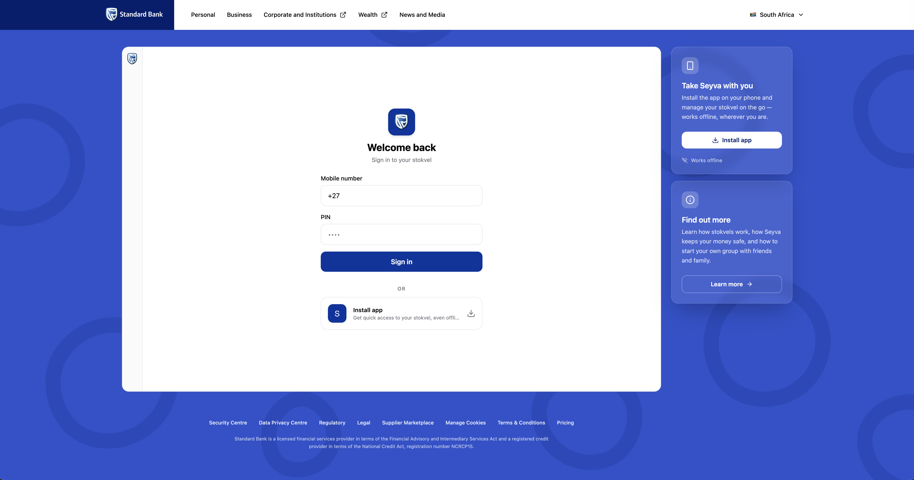

# Seyva Stokvel

A Standard Bank–themed PWA for managing community savings groups (stokvels).
Built as a demo of what a banking-grade, offline-first, low-data web app
can look like for South African mobile users.



---

## What it is

Seyva is a Progressive Web App built as a Standard Bank demo for **stokvels** — the rotating savings groups that millions of South Africans use to pool money, build credit, and pay school fees. A typical stokvel has 5–20 members who each contribute a fixed amount monthly; the full pot rotates to one member per cycle.

The target user is on a **low-end Android phone on a prepaid data plan**. That single constraint drives almost every technical decision in the project: a 200 KB JS budget, an offline-first data layer, AES-encrypted local storage so sensitive data never leaves the device unprotected, and a PWA install path so the app works like a native app without the cost of an App Store download.

---

## Live demo

| | |
|---|---|
| **PWA** | https://dev.seyva.daniellourie.me |
| **API** | https://api.dev.seyva.daniellourie.me |

Sign in with phone `+27821000001`, PIN `1234`. This is Nomsa Dlamini's account — the demo stokvel has 8 members and 3 months of seeded contribution history. Any contribution you submit persists for the session.

---

## Architecture at a glance

```
┌─────────────────────────────────────┐
│           Vite PWA (React 19)        │
│  TanStack Router + TanStack Query   │
│  IndexedDB (AES-256-GCM encrypted)  │
│  Workbox service worker             │
└────────────────┬────────────────────┘
                 │ /api/* (same-origin proxy in dev,
                 │  subdomain in prod)
┌────────────────▼────────────────────┐
│         Hono BFF (Bun runtime)       │
│  Session auth · Rate limiting        │
│  Security headers · Request IDs      │
└────────────────┬────────────────────┘
                 │
┌────────────────▼────────────────────┐
│    Postgres (Neon serverless)        │
│    In-memory session store           │
└─────────────────────────────────────┘
```

The frontend is a static PWA shell — no SSR, no server-rendered HTML. The BFF exists purely to own auth, enforce security headers, and gate data behind a session cookie. The two are kept strictly separate: the frontend never embeds business logic, the BFF never renders UI concerns.

In development, Vite proxies `/api/*` to `localhost:3000` so the frontend uses relative URLs and there's no CORS to configure. In production, the PWA is on a CDN, the BFF is an AWS Lambda behind CloudFront, and they share a subdomain so cookies work same-site.

---

## Repo structure

```
seyva-stokvel/
├── apps/
│   ├── stokvel-app/          # Vite PWA — the frontend (this is the main thing)
│   │   ├── src/
│   │   │   ├── routes/       # TanStack Router file-based routes
│   │   │   ├── features/     # Feature folders (auth, dashboard, contributions, members, pwa)
│   │   │   ├── components/   # Generic shared components
│   │   │   ├── layout/       # App chrome (nav, PIN lock screen, update prompt)
│   │   │   ├── lib/          # Core utilities (crypto, IDB cache, version guard, logger)
│   │   │   └── copy/         # All user-facing strings (EN, ZU, AF)
│   │   └── vite.config.ts
│   └── stokvel-api/          # Hono BFF — session auth, security headers, data endpoints
│
├── packages/
│   ├── ui/                   # shadcn/ui components + Storybook
│   ├── api-client/           # Typed BFF client factory (no React dependency)
│   ├── validation/           # Shared Zod schemas (used by both BFF and PWA)
│   ├── types/                # Shared TypeScript types
│   ├── utils/                # SA-specific formatters (money, phone, date)
│   └── db/                   # Drizzle ORM schema, migrations, seed
│
├── tests/
│   └── e2e/                  # Playwright end-to-end tests (4-way browser matrix)
│
├── docs/
│   ├── decisions.md          # 15 architectural decision records
│   └── architecture/         # Deep-dives on persistence, security, testing, i18n
│
└── infrastructure/           # Terraform — AWS CloudFront + Lambda + SSM
```

---

## Stack decisions

### Vite + React — not Next.js

The app is a static PWA shell with no server-rendered HTML, so Next.js's main selling point — App Router, RSC, SSR — would add complexity we'd never use. More importantly, a server-rendered app makes Workbox precaching harder: the asset list has to be predictable at build time for the service worker to work correctly, and SSR muddies that.

Vite gives us a fast dev loop, first-class support for the `vite-plugin-pwa` / Workbox pipeline, and Rollup's production output which is easy to reason about for bundle-size enforcement. The Vite PWA plugin handles manifest injection, service worker generation, and precache manifest — all in one place.

React 19 brings concurrent features and the ecosystem depth we needed — TanStack Router and Query are React-first, and Radix UI (which shadcn/ui wraps) has the best accessibility primitives in the React space.

### TanStack Router — not React Router

React Router v6/v7 doesn't give you end-to-end type safety on route params and search params — you cast from `string`. TanStack Router generates a full route tree at build time, so `useParams()` returns typed values and the compiler catches broken links.

The other reason: loaders. TanStack Router's `loader` + `context` pattern lets each route declare its data dependencies and receive a `queryClient` via context, so `loader: ({ context }) => context.queryClient.ensureQueryData(dashboardQueryOptions)` prefetches data before the component renders. React Router's loader story works but doesn't compose as cleanly with TanStack Query.

The one cost is the generated `routeTree.gen.ts` — it has to be kept in sync, so the pre-commit hook regenerates it before typecheck runs. That's a small tax for the type safety throughout.

### TanStack Query — not SWR, not RTK Query

TanStack Query's `queryOptions` pattern lets you declare a query's key, fetch function, `staleTime`, and `gcTime` in one place and import that object anywhere — the route loader, the component, the test. SWR's API scatters that across `useSWR` call sites.

The bigger reason: the `@tanstack/query-async-storage-persister` package gives us a first-class IndexedDB persistence bridge. SWR has no equivalent — you'd wire it up yourself. RTK Query has a persistence story but it means pulling in Redux, which is significant overhead for an app that doesn't need global state management beyond what Query already provides.

TanStack Query also has better suspense support. Each route declares a `pendingComponent` (skeleton), the loader prefetches via `ensureQueryData`, and the component reads with `useSuspenseQuery` — no `isLoading` conditionals, no blank-panel flash.

### Biome — not ESLint + Prettier

ESLint + Prettier is two tools, two configs, and a chronic source of rule conflicts. On a slow machine — which the target dev environment might be — pre-commit hooks running both add 3–5 seconds per commit. Biome replaces both with a single binary written in Rust, running in roughly 50 ms on this codebase.

The tradeoff is ecosystem: Biome has fewer plugins than ESLint. For this project that's fine — we're not running a custom rule suite. The rules we care about (`noExplicitAny`, `noUnusedImports`, devtools-import guard) are all available and configured in `biome.json`.

### shadcn/ui — not a runtime component library

shadcn/ui copies component source into your repo. The components compile to plain CSS classes via Tailwind; there's no runtime style injection. We own every component — if a Radix primitive does something we don't like, we change it directly rather than filing a PR upstream and waiting.

The other reason is the Content Security Policy (CSP). Runtime component libraries inject `<style>` tags dynamically, which requires `'unsafe-inline'` in `style-src` — incompatible with a strict CSP. shadcn/ui is Tailwind-native so the strict policy holds.

### `useCopy()` hook — not `react-i18next`

South Africa has 11 official languages. We ship English, Zulu, and Afrikaans in v1, but the structure has to be drop-in compatible with a proper i18n library later — no string concatenation in components, all strings in one place, pluralisation and interpolation supported from day one.

`react-i18next` would work, but it's ~30 KB gzipped and needs a provider wrapping the tree. Instead, `useCopy()` is backed by a `useSyncExternalStore` store that holds the active locale object. Switching locale updates the store, every subscriber re-renders. No provider, no context, ~2 KB.

The key structural decision is the key shape: `copy.dashboard.balanceTitle`, `copy.contributions.offlineDisabledMessage`. That matches `react-i18next`'s conventions exactly, so migrating later is a find-and-replace on the import, not a restructure of every component.

---

## Service worker & Workbox strategy

The service worker (SW) has one job: make the app shell available offline. That means precaching the compiled HTML, JS chunks, CSS, fonts, and icons at install time so the app loads instantly on a flaky connection — or no connection at all.

What Workbox does **not** do here is cache API responses. That's a deliberate choice. React Query with IndexedDB persistence already handles offline data: it stores parsed query results, manages staleness, and shows previous data during refetches. Adding a Workbox runtime cache for the same endpoints would mean two separate caches storing the same data in different formats — a source-of-truth problem. It would also create a cross-user contamination risk on shared devices, since the Cache API doesn't get cleared on sign-out the way IndexedDB does.

```ts
// vite.config.ts
workbox: {
  globPatterns: ['**/*.{js,css,html,ico,png,svg,woff2}'],
  runtimeCaching: [], // explicitly empty — no API caching
}
```

**Update behaviour** is set to `registerType: 'prompt'`. `skipWaiting` and `clientsClaim` are left at their defaults (both false). In a banking context, an automatic reload mid-session would be alarming — imagine a balance screen refreshing itself unexpectedly. Instead, the `UpdatePrompt` component shows a dismissable toast ("Update available — Refresh / Later") when a new SW is waiting. The registration also polls `registration.update()` hourly in the background so long-lived sessions don't miss updates.

The **forced-update path** (`lib/sw-update/force-update.ts`) is different. When the server sets `updateLevel: 'forced'`, the app calls `forceUpdate()` which unregisters all service workers, clears every cache including the precache, and reloads. This is intentionally more destructive than `signOut()`, which deliberately preserves the precache so the `/login` screen loads offline after logout. The two paths are asymmetric by design: a forced update means "you cannot continue on this version at all", so we accept that the user needs connectivity to re-download the shell.

One non-obvious detail: `vite-plugin-pwa` defaults to registering the SW via an inline `<script>` tag in `index.html`. The production Content Security Policy (CSP) blocks all inline scripts — that's the whole point of a strict CSP — so the default would silently break SW registration in prod. Setting `injectRegister: 'script-defer'` tells the plugin to emit a separate `/registerSW.js` file and load it with a normal `<script src>` tag instead, which the CSP allows.

---

## Data caching strategy

There are three layers a query result passes through, in order:

```
Network (Hono BFF)
  ↓ fresh data written through
IndexedDB (idb-cache.ts) — AES-256 encrypted, survives refresh + offline
  ↓ restored into
React Query in-memory cache — serves in-session navigation instantly
```

**Network-first, cache fallback.** Every query function tries the network first, writes the result through to IndexedDB on success, and falls back to the IndexedDB entry if the network fails. The wrapper that does this — `cachedQueryFn` in `lib/persist/idb-cache.ts` — means each query definition is a one-liner:

```ts
queryFn: () => cachedQueryFn('dashboard', () => api.stokvel.balance(id), { ttl: FIVE_MINUTES })
```

We chose network-first over stale-while-revalidate deliberately. Stale-while-revalidate returns the cached value immediately then updates it in the background — fine for a news feed, but for financial data it means the user sees "R 11,500", it flickers to "R 12,000" a second later. In a banking context a brief loading state is preferable to a value that visibly corrects itself.

In-session navigation is still instant. React Query holds the last result in memory for the duration of `staleTime` — navigating from Dashboard back to Dashboard doesn't hit the network or IndexedDB again.

**Per-query staleness.** The IndexedDB TTL is 30 days for all queries — data survives on disk until eviction regardless of type. TTL is a graceful-degradation safety net: mutations invalidate affected queries immediately, login and sign-out wipe everything. The 30-day TTL only kicks in if a user goes weeks without any invalidation signal, at which point a refetch is reasonable.

What varies per query is React Query's `staleTime`: how long data is considered fresh in memory before a background refetch fires. Within the `staleTime` window, navigating back to a screen serves the in-memory result instantly with no network call — that's why in-session navigation feels instant even though the strategy is network-first. Queries are split into two groups:

| Query | staleTime | Why |
|---|---|---|
| Balance | 5 min | Directly affected by contributions — needs to stay current |
| Contributions | 5 min | New submissions should appear promptly |
| Members | 60 min | Roster changes are rare; frequent refetches would waste data |
| Stokvel info | 60 min | Group name and rules almost never change mid-session |

**Mutations are network-only.** Contribution submissions and auth calls never touch any cache. The contribution form disables the submit button when `navigator.onLine === false` with a clear message. No offline queue, no optimistic updates for money. If the request fails the user sees an error and retries — there's no ambiguous "pending" state for a payment.

---

## Cache eviction & size budget

Low-end Android devices have limited storage and browsers enforce per-origin quotas. Without an eviction strategy, the IndexedDB cache grows unboundedly — eventually hitting the quota and throwing `QuotaExceededError` on writes, which would silently stop data from being cached at all.

**Size budget.** The cache targets two budgets depending on the device:

```ts
const SIZE_BUDGET_BYTES = lowMemoryDevice() ? 1 * 1024 * 1024 : 5 * 1024 * 1024;

function lowMemoryDevice(): boolean {
  const mem = (navigator as Navigator & { deviceMemory?: number }).deviceMemory;
  return typeof mem === 'number' && mem < 1; // less than 1 GB RAM
}
```

`navigator.deviceMemory` is part of the Device Memory API — Safari and older Firefox don't expose it, so we default to the generous 5 MB budget when it's unavailable. The 1 MB budget on low-memory devices keeps us well inside browser quota limits on cheap Android hardware.

**Three-pass eviction.** An `evict()` pass runs on app boot (after PIN unlock), hourly while the tab is open, and after large writes. It works through three layers in order:

1. **TTL expiry** — any entry past its TTL is dropped unconditionally, regardless of the `persistent` flag.
2. **Cold tail** — entries that haven't been refreshed in 30 days are dropped. A member list that was last fetched a month ago isn't worth keeping.
3. **Size budget** — if the total is still over budget, the oldest non-`persistent` entries are dropped first. If that's still not enough, the oldest `persistent` entries go too — it's a last resort, but a re-fetch is preferable to a write failure.

**Eviction without a full LRU.** A true least-recently-used cache records "this entry was just accessed" on every read. In IndexedDB that means doing a write on every read — adding latency to every query. Instead, entries track when they were last fetched from the server, and the entries we know are important are marked `persistent` so they're always evicted last. It's a simpler approximation that works fine here because the data that matters most is already flagged.

---

## Persistence & encryption

**Why IndexedDB.** The two obvious alternatives were `localStorage` and `sqlite-wasm`. localStorage is synchronous, capped at ~5 MB, and stores everything as strings — workable but awkward for structured data and encryption. `sqlite-wasm` would give us real SQL with indexed lookups, but the WASM binary alone is ~3 MB, which is fifteen times our entire JS budget. IndexedDB via `idb-keyval` costs effectively nothing in bundle size and the access patterns here — key lookups and one filtered list — don't need SQL.

**What gets encrypted.** Every entry written to the IndexedDB cache is AES-256-GCM encrypted. There's no plain tier. An earlier design split data into "public-ish" (member names, stokvel rules) and "sensitive" (balance, contributions), but that created a classification problem — member phone numbers were originally in the plain tier until we noticed that phones are PII. One rule is simpler and safer: everything at rest is encrypted.

The only unencrypted client-side storage is `localStorage`, which holds metadata with no sensitive content — the version guard state and the active locale. These also need to be readable before the encryption key is in memory, so they can't be encrypted anyway.

**How encryption works.** We use AES-256-GCM via the browser's built-in Web Crypto API (`crypto.subtle`) — no third-party crypto library, no bundle cost. Each write generates a fresh random 12-byte initialisation vector (IV), encrypts the payload, and stores the IV prepended to the ciphertext as a single base64 blob. AES-GCM includes an authentication tag in the ciphertext, so any tampering with a stored entry causes decryption to throw — we treat that as a `CacheTamperError` rather than a normal cache miss.

**The key lifecycle.** The AES-256 session key never touches disk in raw form — it lives in memory only. Here's how it moves through the different states the app can be in:

_At login:_
- The BFF returns the AES-256 key as a base64 string alongside the session cookie
- The frontend imports it into memory as a `CryptoKey` object via Web Crypto
- Immediately, a PIN-encrypted copy of the raw key bytes is stored in IndexedDB as a wrapped blob — this is the offline fallback

_During a session (page refresh, tab reopen):_
- The session cookie is still valid, so the boot-time `/api/me` call re-delivers the key
- Memory is restored automatically — no PIN prompt needed

_After an idle lock or with no connectivity:_
- No `/api/me` is available
- The user enters their PIN → we run PBKDF2-SHA256 (600,000 iterations) on it → use the derived key to decrypt the wrapped blob → session key is back in memory
- The encrypted cache is readable again without touching the server
- The 600,000 PBKDF2 iterations take ~1–2 seconds on a low-end device intentionally — it raises the cost of offline brute-force if the IDB blob is ever extracted

_On sign-out:_
- Key cleared from memory
- Entire IndexedDB database deleted — not just the cache entries, the whole database
- The wrapped blob is gone too, so the next user on the same device starts completely clean

**Cold start without a session.** If there's no session cookie and no wrapped blob — a first visit, or after sign-out — there's no key. Encrypted cache reads return `null` and are treated as cache misses. The app falls back to the network silently; it never surfaces a crypto error to the user.

---

## App update & kill switch

Most PWAs update silently in the background. In a banking context that's not acceptable — a user mid-transaction shouldn't have their app reload without warning, and an ops team needs a way to force users off a broken or compromised version immediately.

**Four update tiers.** The BFF exposes `GET /api/app/version-check` which returns one of four levels based on the current client version against `minVersion` and `latestVersion` in `apps/stokvel-api/src/config/versions.ts`:

| Level | UI | Dismissable |
|---|---|---|
| `none` | Nothing | — |
| `optional` | Toast: "Update available" | Yes |
| `recommended` | Persistent banner | Yes |
| `forced` | Full-screen gate, app blocked | No |

`forced` is the kill switch — the authenticated app tree doesn't render at all until the user updates. It's reserved for genuine emergencies: a security vulnerability, a broken API contract, a compliance requirement. The version config is a file in the BFF repo, so flipping it requires a redeploy — it's not an instant kill, and the README calls that out explicitly.

**Two paths to detection.** The client doesn't rely solely on the 5-minute poll. Every authenticated API response includes `X-Min-Client-Version` and `X-Latest-Client-Version` headers. The API client interceptor reads these on every response and bumps the update level immediately if needed — so a user hitting any endpoint gets notified within the same request, not at the next poll interval. Critically, the header path only ever bumps the level up, never down — only the full version-check poll has enough context to lower it.

**The max-staleness guardrail.** The version check fails open on network errors — a 5xx or timeout is treated as `none` for that poll so a BFF outage doesn't lock users out. But that creates an attack: a network-positioned adversary could black-hole only the version-check endpoint to keep a vulnerable old client running indefinitely. The guardrail closes that gap:

```ts
if (now - lastSuccessfulCheckAt > MAX_STALENESS_MS) {
  // block the app regardless of stored updateLevel
}
```

If the last successful check was more than `MAX_STALENESS_MS` ago (default 24 hours), the app blocks with a "couldn't verify app version — connect to a network and try again" screen rather than the normal authenticated UI. The threshold is a configurable constant, not hardcoded — 24 hours is conservative for a demo, but a real deployment to rural SA users with legitimate weekend off-grid time might set it to 72 hours.

**Updating.** "Refresh" on the update prompt calls `updateServiceWorker(true)` from `vite-plugin-pwa`. If that doesn't work — the service worker is already the latest, or SW registration failed — it falls through to `forceUpdate()`: unregister all service workers, clear all caches, hard reload. One helper, two paths, one outcome.

---

## Performance budget

The target user is on a prepaid data plan where every megabyte costs money. "Fast" isn't a nice-to-have — it's the brief. So we set hard numbers and enforce them in the build pipeline:

- **Initial JS: ≤ 200 KB gzipped** — everything needed for the first authenticated paint
- **Total transfer: ≤ 500 KB gzipped** — JS + CSS + fonts + icons combined

These aren't aspirational. The build fails if either threshold is exceeded:

```ts
// scripts/check-bundle-size.ts — runs after every vite build
if (initialJsGzip > 200_000) process.exit(1);
if (totalTransferGzip > 500_000) process.exit(1);
```

It's wired into the Turborepo `build` task and runs on pre-push, so a bundle regression can't land without the developer seeing it locally first.

**How we stay under budget.** The main levers:

_Manual chunk splitting._ Vite's default chunking puts everything in one bundle. We split the three heaviest vendors into their own chunks so repeat visitors only re-download what changed:

```ts
manualChunks: {
  'react-vendor': ['react', 'react-dom'],
  'query-vendor': ['@tanstack/react-query', '@tanstack/react-query-persist-client'],
  'router-vendor': ['@tanstack/react-router'],
}
```

_Devtools never ship to production._ TanStack Router devtools and React Query devtools are heavy. They're dynamic-imported and gated behind `import.meta.env.DEV` — they don't appear in the prod bundle at all. Biome enforces this with a lint rule that errors if either devtools package is imported outside of `App.tsx`.

_Hidden source maps._ Production builds use `sourcemap: 'hidden'` — the source maps are emitted so a monitoring tool like Sentry can symbolicate stack traces, but they're not referenced in the bundle so browsers don't download them. Users on metered data don't pay for source maps they'll never use.

**Visibility.** Every production build emits a `dist/stats.html` bundle visualiser (via `rollup-plugin-visualizer`) showing each module's contribution to the final bundle by gzip size. It's the first place to look when the budget check starts getting close.

The current build lands at **198 KB initial JS** and **217 KB total transfer** — both comfortably within budget with headroom for the features still to come.

---

## Security highlights

Most of the security work is in the BFF, but several decisions live squarely on the client and are worth walking through.

**Strict Content Security Policy.** The CSP blocks inline scripts entirely — `script-src 'self'` with no `'unsafe-inline'`. This is the seatbelt against cross-site scripting (XSS): even if an attacker injects a script tag into the page, the browser refuses to run it. The Vite bootstrap script is the one inline script that can't be avoided, so its SHA-256 hash is computed at build time and added to the CSP header — only that exact script is allowed to run inline, nothing else.

The same applies to styles — `style-src 'self'` with no `'unsafe-inline'`. shadcn/ui is Tailwind-native and compiles to a static stylesheet, so the strict policy holds. Any component library that injects styles at runtime would have forced us to relax it.

**In-memory key only.** As covered in the encryption section, the AES-256 session key never touches disk. The reason this matters from a security perspective: if an attacker gains read access to the device's storage — a malicious browser extension, a compromised third-party script, physical access — they get encrypted blobs they can't read without the PIN-derived wrapping key. The key they'd need is only ever in memory, cleared on idle lock after 60 seconds of inactivity.

**Idle lock.** After 60 seconds of inactivity the key is zeroed from memory and a PIN lock overlay covers the app. The user re-enters their PIN to unwrap the key and continue — no server roundtrip required, works fully offline. This limits the window where a stolen unlocked device exposes financial data.

**Hidden source maps.** `sourcemap: 'hidden'` means the production JS is minified and the source maps exist on the build server but aren't referenced from the app. Anyone opening DevTools in production sees minified identifiers — they can't read the structure of `key-store.ts`, trace the encryption flow, or identify the sensitive query keys list. Monitoring tools that have access to the source maps can still symbolicate crash reports.

**On the BFF side** (brief, since this is a frontend role): login responses are constant-time regardless of whether the phone number exists, the PIN is wrong, or the account is rate-limited — all return the same 401 shape after the same delay so timing attacks can't distinguish between failure modes. Sessions are bound to a User-Agent fingerprint so a stolen cookie doesn't work from a different browser. Rate limiting runs three layers: per phone number, per IP, and a global anomaly counter.

---

## Testing

**Unit tests — Bun test.** Unit tests run with Bun's built-in test runner. Tests that need DOM APIs (React hook tests, component tests) register happy-dom manually via `@happy-dom/global-registrator` — only the tests that need a DOM pay for it, the rest run in plain Bun. The suite covers the parts of the frontend where a bug would be silent and hard to spot in end-to-end tests: the crypto layer (AES-GCM encrypt/decrypt, PIN-wrap/unwrap, tamper detection), the IndexedDB cache (TTL expiry, eviction passes, cache miss on missing key), the copy/i18n system (shape matching across locales, interpolation, pluralisation), and the stateful hooks (`useIdleLock`, date formatters).

**End-to-end tests — Playwright.** The end-to-end suite runs across a 4-way browser matrix:

| | Desktop | Mobile |
|---|---|---|
| **Chrome** | Chromium | Mobile Chrome |
| **Safari** | WebKit | Mobile Safari |

The BFF binds each session to a User-Agent (UA) fingerprint (a hash of OS family + browser engine + major version) so sessions aren't portable between browsers. A Desktop Chrome session presented from a Mobile Safari UA gets a 401. That means each browser project needs its own authenticated session, not a shared one.

The fix is per-project auth setup: each of the four projects has its own setup file that signs in using that project's UA and writes a project-scoped storage state file to `playwright/.auth/<project>.json`. Tests start pre-authenticated — no login step in every spec, no rate-limit collisions from repeated login attempts across the matrix.

The end-to-end specs cover: authentication (happy path + wrong PIN), navigation, PWA behaviour (install prompt, offline mode, update prompt), language switching, accessibility via axe-core, and visual regression.

**Visual regression — Docker.** Font rendering differs between macOS and Linux, which means the same component produces different pixel output on a Mac dev machine versus a Linux CI runner. To get deterministic baselines, visual regression tests only run inside a Docker container based on the official Playwright image. Baselines are committed to the repo as `*-linux.png` and regenerated with `bun run test:e2e:update-snapshots` — which also runs inside Docker. Local dev runs the rest of the suite natively for speed; only the visual tests need the container.

**Pre-push hook.** A production build runs on every `git push`. The build includes the bundle size check, so a push that would exceed the 200 KB budget fails before it reaches the remote.

---

## What's deferred

Being honest about known gaps is part of the design process. These are the items that were consciously deferred, documented, and would be the first things addressed before a production launch.

**WebAuthn for key storage.** The PIN-wrap approach is the weakest link in the security model. A 4-digit PIN + PBKDF2 slows offline brute-force but doesn't defeat a determined attacker who extracts the IndexedDB blob. The production path is WebAuthn — wrapping the session key with a passkey bound to the device's secure enclave gives hardware-backed protection without a PIN at all. It was deferred because WebAuthn support on cheap Android is inconsistent, not because it's the wrong answer.

**Content Security Policy on the PWA shell.** The BFF sets strict CSP headers on every API response. The PWA shell — the static HTML, JS, and CSS served from the CDN — doesn't have CSP headers yet. That's the higher-value surface to protect since it's what loads in the browser first. In production this would be set at the CDN level (a CloudFront response headers policy or equivalent).

**HMAC signing on version-check responses.** The version guard state is stored in `localStorage`, which any XSS or devtools paste can modify. The mitigation is HMAC-signing the version-check response server-side so the client can verify it hasn't been tampered with before trusting a cached tier. The max-staleness gate is the primary defence for now; HMAC is the layered second that didn't make the demo cut.

**Auth test coverage.** The unit and end-to-end suites cover the happy path thoroughly but have gaps in auth-specific edge cases: wrong PIN lockout, rate-limit behaviour, UA-fingerprint mismatch, idle timeout expiry, and the full logout flow. These are the tests that matter most in a banking context and would be the first addition before a real launch.

**Production session and rate-limit stores.** Sessions and rate-limit buckets live in in-memory Maps in the BFF. A BFF restart clears all sessions, and multiple BFF instances can't share state. Production would back these with Redis. The repository abstraction is already in place — it's a driver swap, not a restructure.

---

## Running locally

**Prerequisites:** Bun 1.3.13+, Node 20+, Docker (for Postgres).

```bash
# 1. Install dependencies
bun install

# 2. Start Postgres
docker compose up -d postgres

# 3. Copy the API env file and run migrations
cp apps/stokvel-api/.env.example apps/stokvel-api/.env
bun --filter @seyva/db run migrate
bun --filter @seyva/db run seed

# 4. Start everything
bun run dev
```

The Vite dev server runs on `http://localhost:5173` and proxies `/api/*` to the Hono BFF on `http://localhost:3000` — no CORS configuration needed. Sign in with phone `+27821000001`, PIN `1234`.

For real-device testing over LAN (the actual target device profile), set `HTTPS=true` before starting Vite. `vite-plugin-mkcert` installs a locally-trusted certificate on first run so the service worker works correctly on the device.

---

## Deployment & CDN headers

The PWA is a static build deployed to S3 + CloudFront. The BFF is a Bun-compiled Lambda behind the same CloudFront distribution, reachable at a subdomain. Infrastructure is managed with Terraform in `infrastructure/`.

```bash
./scripts/deploy-pwa.sh dev   # build + sync to S3 + invalidate CloudFront
./scripts/deploy-api.sh dev   # bundle + deploy Lambda
```

**CDN cache headers.** Getting these wrong silently breaks PWA updates — if `index.html` or `sw.js` are cached by the CDN, users never receive new versions:

| Path | Cache-Control |
|---|---|
| `index.html`, `sw.js`, `manifest.webmanifest` | `no-cache` |
| `/assets/*` (hashed filenames) | `public, max-age=31536000, immutable` |

Hashed assets are safe to cache forever — the filename changes with every build. `index.html` and the service worker must always be revalidated so the browser picks up new asset hashes and triggers the update prompt.

**Kill switch.** To block clients below a given version, update `minVersion` in `apps/stokvel-api/src/config/versions.ts` and redeploy the BFF. To block all clients regardless of version, set `globalOverride: 'forced'` in the same file. This requires a BFF redeploy — it's a soft switch, not an instant kill. A production deployment would back this with a feature-flag service for runtime changes without a deploy.

---

## CI/CD

Three GitHub Actions workflows, all path-filtered to `apps/stokvel-app/**`, `packages/**`, and `bun.lock`.

**`ci.yml` — pull requests**
Lint, typecheck, and unit tests run in parallel; build is blocked until all three pass. `VITE_API_BASE_URL` is injected from secrets so the PR build is identical to what ships. Concurrency is cancel-in-progress so fast-follow pushes don't queue.

**`deploy.yml` — push to main**
Same lint → typecheck → test → build chain, then S3 sync (`--delete` flag keeps the bucket clean) and a targeted CloudFront invalidation of `index.html`, `sw.js`, and `manifest.webmanifest` only — hashed assets are immutable and don't need invalidating. Deploy concurrency is `cancel-in-progress: false` so no push ever gets skipped. IAM is scoped to the minimum: S3 read/write on the site bucket and `cloudfront:CreateInvalidation` on that distribution only.

**`release.yml` — versioning**
release-please reads conventional commits and opens a release PR when warranted, bumping `package.json`, `CHANGELOG.md`, and the manifest. The version is embedded into the bundle at build time via `process.env.npm_package_version` → `__APP_VERSION__`, which the client sends on every `/api/app/version-check` call — that's how the kill switch knows whether to block a given client.

**CDN cache headers**

| Path | Cache-Control |
|---|---|
| `index.html`, `sw.js`, `manifest.webmanifest` | `no-cache` |
| `assets/*` (hashed) | `public, max-age=31536000, immutable` |

**What a production pipeline would add**
A `lighthouserc.json` is already configured with score thresholds (performance ≥ 85, accessibility ≥ 90) — in production this gates PRs rather than running on demand. The Playwright E2E suite (`tests/e2e/`) covering auth, offline, IDB encryption, visual regression, and a11y would run the full browser matrix (Chromium, WebKit, Mobile Chrome, Mobile Safari) before deploy. BrowserStack or similar for real low-end Android — emulation doesn't capture the actual target device.

**Production gap — BFF version injection**
The BFF reads `process.env.APP_VERSION` to know what version to advertise in `X-Latest-Client-Version` headers and the version-check endpoint. In this demo it's set manually on the Lambda. In production the deploy step would write it to SSM after each frontend release and the BFF would read it on cold start. The kill-switch `minVersion` is intentionally hardcoded in `versions.ts` and requires a BFF redeploy — deliberate, documented in the [App update & kill switch](#app-update--kill-switch) section.
